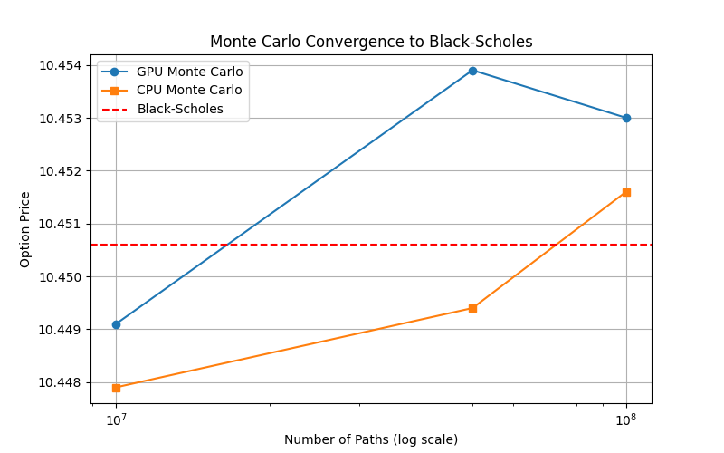
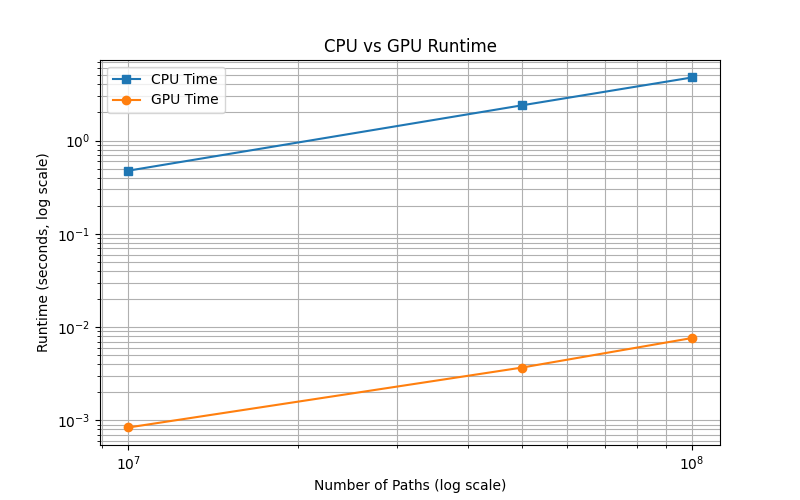

# Monte Carlo European Option Pricing (CUDA & CPU)

This project implements a **European call option pricing simulator** using both **CPU and GPU (CUDA)** Monte Carlo methods. It compares performance, accuracy, and convergence to the analytical **Black–Scholes formula**.

---

## Features

- GPU-accelerated Monte Carlo simulation using **CUDA**.
- CPU-based Monte Carlo reference implementation.
- Black–Scholes formula for analytical comparison.
- Runtime and convergence analysis for large numbers of simulated paths.
- Histogram visualization of terminal stock prices (optional, using sampled data).

---

## Project Structure

montecarlo-option-pricing/
│

├── main.cu # Main C++ program (CPU + GPU simulation)

├── util.h # Utility with includes

├── results.csv # CSV output with prices and runtimes

├── plot_results.py # Python script to generate plots

├── convergence.png # Generated convergence plot

├── runtime.png # Generated runtime plot

└── README.md # Project description and instructions


---

## Dependencies

### C++ / CUDA
- CUDA Toolkit (tested on CUDA 11+)
- nvcc

### Python (for plots)
- Python 3.x
- `pandas`
- `matplotlib`

Install Python dependencies via pip:

```bash
pip install pandas matplotlib

Usage
Compile & Run

make
./montecarlo

This will generate:

    results.csv – contains CPU/GPU prices, Black–Scholes price, and runtimes.

Generate Plots

python3 plot_results.py

This produces:

    convergence.png – Monte Carlo convergence vs Black–Scholes.

    runtime.png – CPU vs GPU runtime comparison.
```
Example Results

Convergence to Black–Scholes:



CPU vs GPU Runtime:


